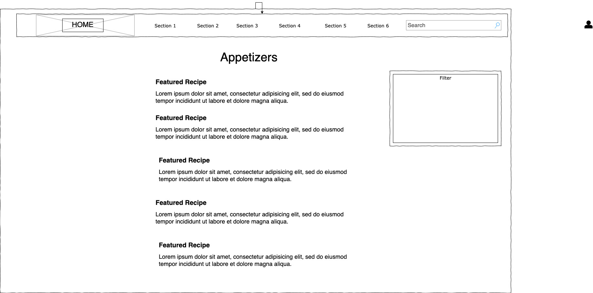
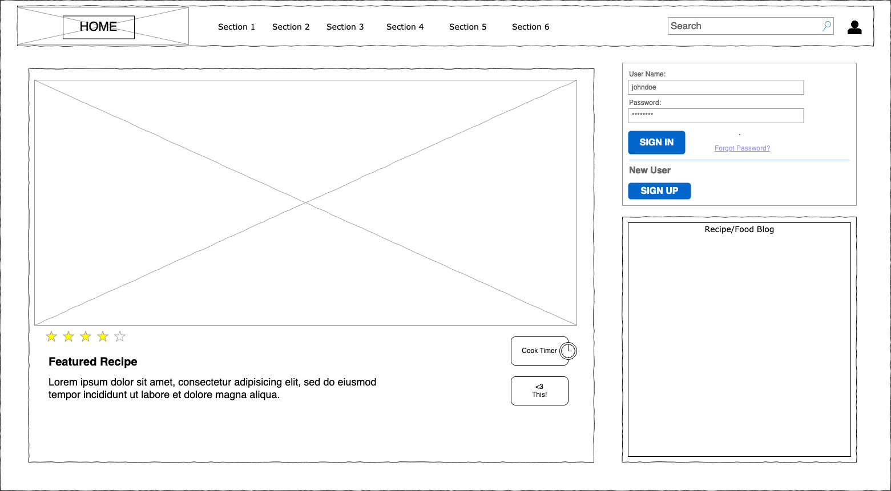
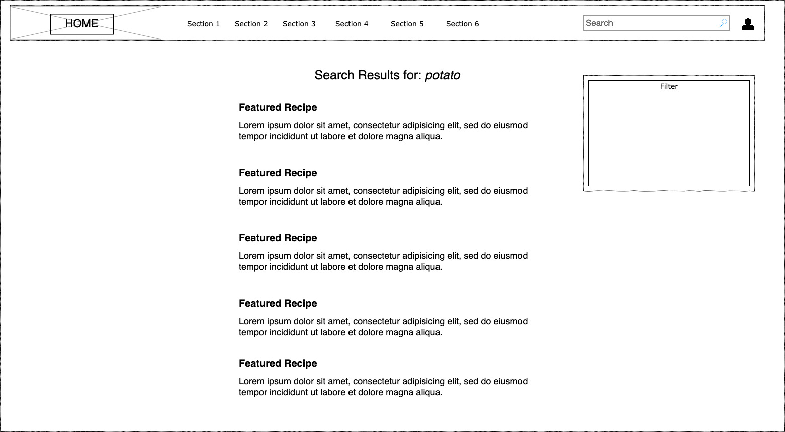
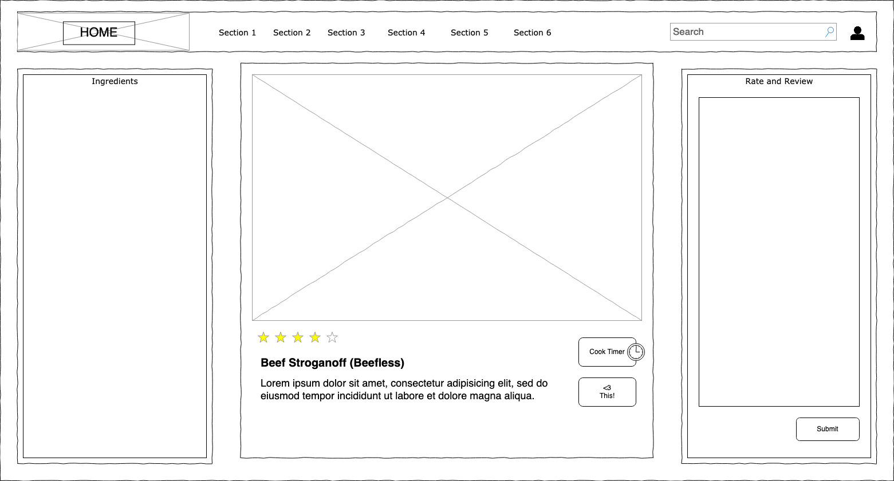

# Project Planning
For this assignment, you'll create some initial plans for your project.

## Assignment Description
[Project Planning Assignment](https://education.launchcode.org/liftoff/modules/assignments/project-planning)

## Submission Instructions

### Wireframes

- 
- 
- 
- 

### Project Tracker

[Liftoff Project Trello](https://trello.com/b/7TMpfels/liftoff-project)

### Project Repo Link
[Github Link](https://github.com/mthreec1983/recipesRus)